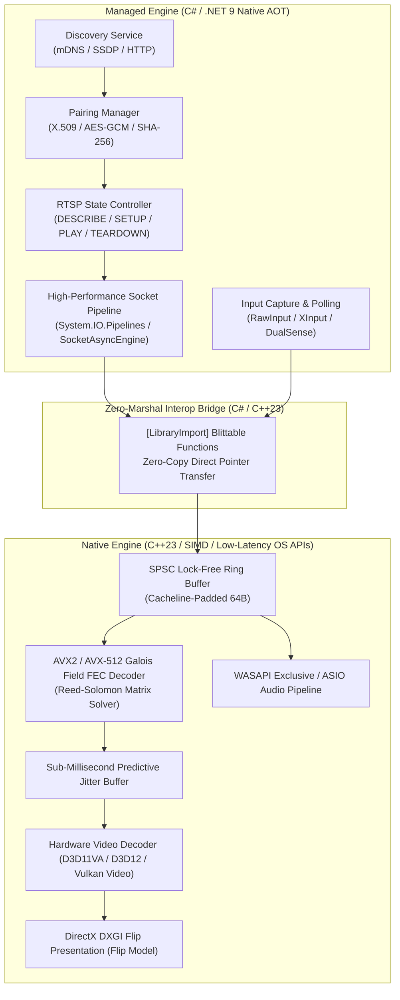
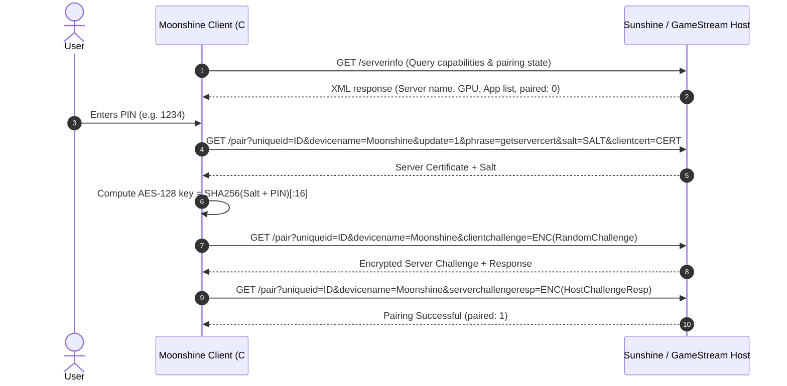

# 🏛 Moonshine Technical Architecture

This document details the architectural design, protocol state machine, memory pipeline, and native interop layer of **Moonshine**.

---

## 1. Architectural Philosophy

Moonshine redefines low-latency streaming by combining:
1. **High-level Expressiveness & Safety**: C# 13 for networking orchestration, cryptographic authentication, configuration, input polling, and state machine transitions.
2. **Bare-Metal Native Performance**: C++23 for SIMD Galois Field arithmetic, hardware video decoder integration, lock-free ring buffering, and exclusive audio rendering.



---

## 2. Protocol Pipelines & State Machines

### 2.1 Host Discovery and Cryptographic Pairing
Moonshine communicates with Sunshine / GameStream hosts over HTTPS (Port 47989 / 47984) and HTTP (Port 47989).



### 2.2 RTSP Stream Negotiation
RTSP session setup occurs over TCP/UDP Port 48010:
1. `OPTIONS`: Query supported server features.
2. `DESCRIBE`: Transmit client capabilities (video resolution, refresh rate, HDR color space, codec preferences [AV1, HEVC, H.264], surround audio config).
3. `SETUP`: Negotiate video stream ports, audio stream ports, and encrypted control stream ports.
4. `PLAY`: Initiate stream transmission.
5. `TEARDOWN`: Graceful teardown.

---

## 3. High-Performance Data Plane

### 3.1 Zero-Allocation Memory Ingestion
Traditional implementations allocate heap buffers on every incoming UDP packet. In Moonshine:
- Network sockets utilize `System.IO.Pipelines` backed by pre-allocated native memory slabs (`NativeMemoryOwner`).
- Packet headers are sliced using `ReadOnlySpan<byte>` and mapped into blittable value structs using `MemoryMarshal.Read<T>`.
- The native layer receives raw pointers `const uint8_t*` directly into pinned memory arenas, guaranteeing **zero managed heap allocations** during streaming.

### 3.2 SIMD Reed-Solomon Forward Error Correction
Moonshine implements vectorised Galois Field $GF(2^8)$ multiplication for parity packet matrix reconstruction:
- **AVX2 Implementation**: Uses `_mm256_shuffle_epi8` with 4-bit nibble tables and 256-bit SIMD registers to process 32 bytes per cycle without branch prediction penalties or memory lookup tables.
- **AVX-512 Implementation**: Leverages `_mm512_gf2p8affine_epi64_epi8` (GFNI - Galois Field New Instructions) where available for single-instruction matrix transformations on 64 bytes simultaneously.

### 3.3 Lock-Free Single-Producer Single-Consumer (SPSC) Ring Buffers
The thread boundary between network packet receipt and frame decode reassembly uses cacheline-padded lock-free SPSC queues:
```cpp
template <typename T, size_t Capacity>
class alignas(64) SpscRingBuffer {
    static_assert((Capacity & (Capacity - 1)) == 0, "Capacity must be power of two");
    alignas(64) std::atomic<size_t> head_{0};
    alignas(64) std::atomic<size_t> tail_{0};
    alignas(64) T buffer_[Capacity];
};
```
This guarantees that the reader and writer cores never invalidate each other's L1/L2 cache lines (`false sharing`), yielding sub-microsecond enqueue/dequeue latency.

---

## 4. Hardware Video & Audio Presentation

### 4.1 Direct3D 11/12 Low-Latency Pipeline
- Direct interfacing with DXGI Swap Chain using `DXGI_SWAP_EFFECT_FLIP_DISCARD` and `DXGI_SWAP_CHAIN_FLAG_ALLOW_TEARING` for VRR (Variable Refresh Rate / G-Sync / FreeSync).
- Zero-copy frame delivery from hardware decoder surface directly into swap chain back buffers.
- Low-latency waitable object synchronization (`IDXGISwapChain2::GetFrameLatencyWaitableObject`) set to `MaxFrameLatency = 1`.

### 4.2 Audio Engine
- WASAPI Exclusive Mode bypasses the Windows Audio Engine mixer, eliminating buffer latency and resampling overhead.
- Direct SIMD Opus packet decoding to float32/int16 PCM buffers.

---

## 5. Summary Table of Performance Metrics

| Subsystem | Latency Target | Memory Allocation Target | Threading Strategy |
| :--- | :--- | :--- | :--- |
| **Network Socket Parsing** | $< 50\,\mu\text{s}$ | $0\text{ bytes/packet}$ | High-priority IO thread |
| **FEC Recovery (AVX2)** | $< 100\,\mu\text{s}$ | $0\text{ bytes}$ (Arena pool) | Dedicated SIMD worker |
| **Jitter Buffer Frame Assembly** | $< 200\,\mu\text{s}$ | $0\text{ bytes}$ (Pre-allocated slots) | Lock-Free Queue |
| **Hardware Video Decode (4K60/120)** | $< 1.5\,\text{ms}$ | Zero-Copy GPU surfaces | GPU Direct Context |
| **Audio Presentation** | $< 4.0\,\text{ms}$ | $0\text{ bytes}$ ring buffer | Realtime Audio Thread |
| **Input Polling & Transmission** | $< 0.8\,\text{ms}$ | $0\text{ bytes}$ stackalloc | 1000Hz Timer/Event Thread |
