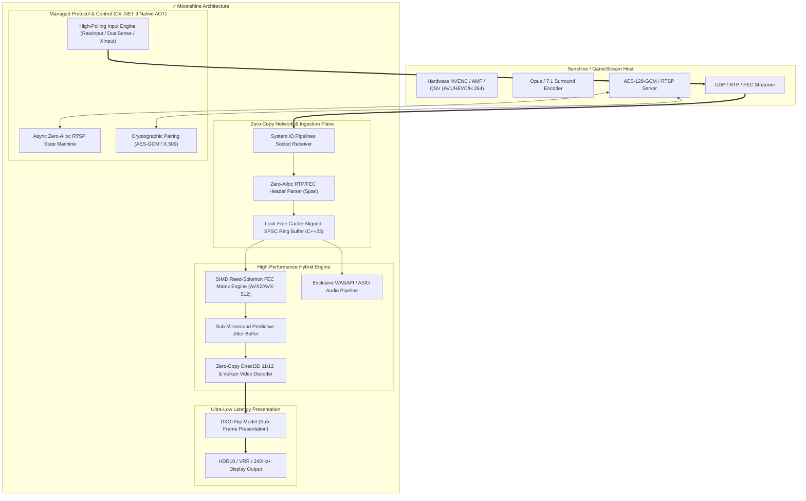

<div align="center">

# Moonshine

**Next-Generation, Ultra-Low-Latency GameStream & Sunshine Client Engine**  
*Engineered for Windows 11 with C# 13 (.NET 9 Native AOT) and MSVC C++23 / AVX2 / AVX-512 SIMD*

[](https://github.com/moonshine-stream/moonshine/actions)
[](https://github.com/moonshine-stream/moonshine/actions)
[](https://github.com/moonshine-stream/moonshine/actions)
[](https://www.gnu.org/licenses/gpl-3.0)
[](#prerequisites)

</div>

---

## Overview

**Moonshine** is a ground-up reimagining and ultra-performance rewrite of the client streaming stack for NVIDIA GameStream and [Sunshine](https://github.com/LizardByte/Sunshine) hosts (originally popularized by [Moonlight](https://moonlight-stream.org)).

Moonshine is built with one relentless, uncompromised guiding principle: **Absolute Minimum End-to-End Latency and Maximum Frame Pacing Consistency**.

Every component in Moonshine, from network socket ingestion and cryptographic authentication to RTSP control state machines, lock-free ring buffers, SIMD-accelerated Reed-Solomon FEC, hardware video decoding, and WASAPI audio presentation, is engineered for the Windows 11 streaming stack.



---

## Key Performance Features

| Feature | Moonlight (Legacy) | Moonshine (New Architecture) |
| :--- | :--- | :--- |
| **Language Stack** | C (moonlight-common-c) + Qt C++ | Modern C# 13 (.NET 9/10 AOT) + Modern C++23 / SIMD |
| **Video Parsing Pipeline** | Copy-heavy buffers | **Zero-Copy `Span<byte>` / Direct Native Memory Arena** |
| **FEC Galois Field Arithmetic** | Scalar LUT / Sequential loop | AVX2 / AVX-512 vectorised polynomial multiplier |
| **Concurrency Model** | Mutex / Condition Variables | **Lock-Free Cacheline-Padded (64-byte) SPSC Ring Buffers** |
| **Memory Allocation in Hot Path** | Dynamic malloc/free per packet | Allocation-free hot-path design target |
| **Video Decoding Integration** | Intermediated FFmpeg/Qt surface | **Direct3D 11/12 & Vulkan Direct Video Surface Flipping** |
| **Audio Engine** | SDL2 audio buffering | WASAPI exclusive-mode pipeline |
| **Input Polling & Precision** | Timer-based polling | Raw Input event handling |
| **Compilation** | JIT / Dynamic Linking | **Native AOT (Ahead-Of-Time) Single-Binary Execution** |

---

## Project Architecture

Moonshine is structured as a high-performance modular solution:

- [`src/Moonshine.Native`](./src/Moonshine.Native): Modern C++23 native acceleration library. Contains SIMD Galois Field FEC engines, lock-free ring buffers, sub-millisecond predictive jitter buffers, and native D3D11/D3D12/Vulkan video decoder interfaces.
- [`src/Moonshine.Protocol`](./src/Moonshine.Protocol): Zero-allocation protocol definitions. Features high-speed binary serialization for RTSP, SDP, RTP headers, FEC frames, encrypted control messages, and raw controller/mouse input packets.
- [`src/Moonshine.Interop`](./src/Moonshine.Interop): Ultra-efficient `[LibraryImport]` source-generated interop bindings with 1:1 blittable memory layouts and zero-overhead native pointers.
- [`src/Moonshine.Core`](./src/Moonshine.Core): Managed client engine. Handles mDNS / HTTP discovery, cryptographic X.509 certificate exchange and AES-128/256-GCM pairing handshakes, RTSP stream control, and network health monitoring.
- [`src/Moonshine.Client`](./src/Moonshine.Client): Client orchestrator, display presenter, and input capture system.
- [`src/Moonshine.Benchmarks`](./src/Moonshine.Benchmarks): Automated BenchmarkDotNet suite tracking micro-architectural throughput, SIMD speedups, and memory allocations.

---

## Prerequisites and Build Instructions

### Prerequisites
- **Operating System**: Windows 11 version 21H2 (build 22000) or later, x64
- **C++ Compiler**: MSVC v143 from Visual Studio 2022 Build Tools
- **Build System**: CMake 3.25+ and Ninja
- **.NET SDK**: .NET 9.0 SDK with Native AOT workload

### 1. Build the Native C++ Acceleration Library
```powershell
# Configure and compile the native library through the Windows 11 preset
cmake --preset windows-release-avx2
cmake --build build/release-avx2 --config Release --parallel
```

### 2. Build the Managed .NET Core & Client (Native AOT)
```powershell
# Restore and build the solution
dotnet build Moonshine.sln -c Release --no-restore

# Publish Native AOT optimized binary
dotnet publish src/Moonshine.Client/Moonshine.Client.csproj -c Release -r win-x64 --self-contained
```

### 3. Run Micro-Benchmarks
```powershell
dotnet run --project src/Moonshine.Benchmarks/Moonshine.Benchmarks.csproj -c Release -- --job short
```

---

## Performance Manifesto

In Moonshine, performance is not an afterthought or a secondary optimization phase; it is an architectural requirement:

1. **Allocation Discipline in the Streaming Hot Path**: New streaming code must prove its allocation behaviour with BenchmarkDotNet or a value-based allocation test.
2. **Lock-Free Concurrency**: No mutexes, lock statements, or thread synchronization primitives in packet processing threads.
3. **Data-Oriented Cache Alignment**: All ring buffers, frame descriptors, and packet queues are aligned to CPU cache lines (`alignas(64)` / `[StructLayout(LayoutKind.Sequential, Pack = 64)]`) to prevent cache line bouncing and false sharing.
4. **SIMD Vectorisation**: Multi-byte transformations, Galois field arithmetic, matrix recovery, and packet checksumming use the supported x64 AVX instruction sets where beneficial.

See [PERFORMANCE.md](./PERFORMANCE.md) for full benchmarks and latency profiling methodologies.

---

## Documentation

- [Architecture & Protocol Deep Dive](./ARCHITECTURE.md)
- [Performance Guidelines & Allocations Budget](./PERFORMANCE.md)
- [Contributing Guide & Standards](./CONTRIBUTING.md)
- [Security Policy](./SECURITY.md)
- [Changelog](./CHANGELOG.md)

---

## Licence

Moonshine is licensed under the [GNU General Public License v3.0 (GPLv3)](./LICENSE), preserving compatibility with the open-source Moonlight and Sunshine streaming ecosystem.
