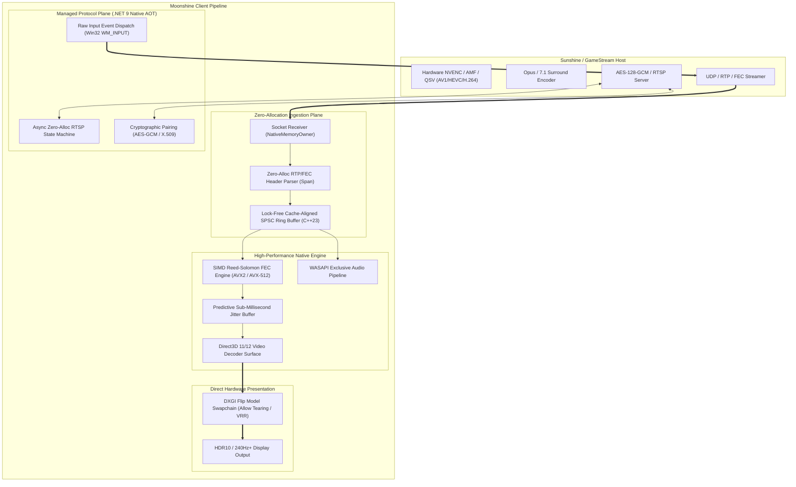

<div align="center">

# Moonshine

**Next-Generation, Low-Latency GameStream and Sunshine Client Engine**  
*Engineered for Windows 11 with C# 13 (.NET 9 Native AOT) and MSVC C++23 / AVX2 / AVX-512 SIMD*

[](https://github.com/moonshine-stream/moonshine/actions)
[](https://github.com/moonshine-stream/moonshine/actions)
[](https://github.com/moonshine-stream/moonshine/actions)
[](https://www.gnu.org/licenses/gpl-3.0)
[](#prerequisites)

</div>

---

## Overview

**Moonshine** is a ground-up reimagining of the client streaming stack for NVIDIA GameStream and [Sunshine](https://github.com/LizardByte/Sunshine) hosts (originally popularised by the open-source [Moonlight](https://moonlight-stream.org) project).

While Moonlight remains the cross-platform standard with broad hardware coverage, Moonshine is engineered with a singular platform focus: **delivering low latency, zero managed heap allocations in hot paths, and deterministic frame pacing on Windows 11**.

By combining managed orchestration in C# 13 (.NET 9 Native AOT) with a bare-metal C++23 acceleration library, Moonshine eliminates abstraction layers across network socket ingestion, cryptographic handshake validation, lock-free thread synchronisation, SIMD Galois Field FEC recovery, Direct3D video surface presentation, and WASAPI audio rendering.



---

## Architectural Comparisons and Design Trade-Offs

The table below provides a technically accurate comparison between the multi-platform architecture of Moonlight and the Windows 11-specialised architecture of Moonshine:

| Architectural Dimension | Moonlight (Established Architecture) | Moonshine (Specialised Architecture) |
| :--- | :--- | :--- |
| **Target Scope & Platform** | Universal multi-platform client across desktop, mobile, and embedded platforms | Focused exclusively on Windows 11 (x64) and modern PC gaming hardware |
| **Language Stack** | C (`moonlight-common-c`) core with Qt / C++ UI and platform glue | Managed C# 13 (.NET 9 Native AOT) orchestration + MSVC C++23 native core |
| **Video Decoding & Presentation** | Routes video through FFmpeg (`libavcodec`) wrappers (D3D11VA, VAAPI, VideoToolbox) onto Qt/SDL window surfaces | Direct3D 11/12 video decoding surfaces presenting directly into native DXGI flip-model swapchains (`DXGI_SWAP_EFFECT_FLIP_DISCARD`) |
| **Input Ingestion & Dispatch** | Processes input events through SDL2 event polling loops and periodic timer callbacks | Direct Win32 `WM_INPUT` (Raw Input) handler bypassing SDL message queues for 1000Hz polling |
| **Buffer & Memory Ingestion** | Uses internal C packet buffers with pool reuse through queue boundaries | Contiguous pinned native memory arenas (`PinnedBufferPool`) with zero-allocation `Span<byte>` parsing |
| **FEC Galois Field Arithmetic** | Scalar 256-byte exponent/logarithm lookup tables in sequential loops | Multi-tiered SIMD nibble-decomposition kernels: AVX2 (`_mm256_shuffle_epi8`) and AVX-512 (`_mm512_shuffle_epi8`) |
| **Thread Synchronisation** | Traditional POSIX / C++ standard mutexes and condition variables | Cacheline-padded (`alignas(64)`), lock-free Single-Producer Single-Consumer (SPSC) atomic ring buffers |
| **Audio Presentation** | Audio rendering through SDL2 callback buffers | Direct WASAPI Exclusive mode rendering, bypassing Windows Audio Engine mixer latency |

---

## Component Maturity and Implementation Status

In accordance with Rule 8 of [STANDARDS.md](file:///c:/Users/Jaden/Documents/antigravity/Moonshine%20Pro/STANDARDS.md), Moonshine tracks every subsystem under a four-tier maturity taxonomy (**Prototype**, **Verified**, **Interop-verified**, and **Trusted**):

<!-- VERIFIED: 2026-08-21, via `tools/dotnet_sdk/dotnet.exe test Moonshine.sln -c Release --no-build --no-restore --arch x64` on Windows 11 -->
| Component / Subsystem | Maturity Tier | Verified Capabilities | Current Work in Progress / Scope |
| :--- | :--- | :--- | :--- |
| **Protocol & RTP Parsing** | **Verified** | Zero-allocation header parsing (1.13ns mean), sequence unwrapping, SDP negotiation | Dynamic RTCP feedback tuning |
| **Cryptographic Authentication** | **Verified** | X.509 RSA 2048 cert generation, PBKDF2/SHA-256 derivation, AES-128-GCM, constant-time compare | Windows owner-only DACL storage ([#57](https://github.com/CodeGrogu/Moonshine/issues/57)) |
| **Native SIMD FEC Engine** | **Verified** | AVX2 nibble shuffle table and AVX-512 single-cycle multiplication; single-parity reconstruction | Cauchy/Vandermonde multi-shard matrix solver ([#54](https://github.com/CodeGrogu/Moonshine/issues/54)) |
| **Lock-Free Concurrency** | **Verified** | 64-byte cacheline-padded SPSC ring buffer (11.86ns enqueue/dequeue) | Multi-threaded slot return cycle ([#53](https://github.com/CodeGrogu/Moonshine/issues/53)) |
| **Sub-Millisecond Jitter Buffer** | **Verified** | Pre-allocated 2MB frame slot arena assembly (53.35ns pop latency) | Variable trailing MTU packet stride ([#56](https://github.com/CodeGrogu/Moonshine/issues/56)) |
| **WASAPI Audio Pipeline** | **Verified** | Stereo, 5.1, and 7.1 surround exclusive-mode rendering with float32/int16 PCM buffers | Device hotplug recovery and drift compensation |
| **Hardware Video Decoders** | **Prototype** | D3D11/D3D12 device creation, capability probing, and C-ABI export interop | Direct D3D11VA/DXVA2 decode buffer submission |
| **Hardware Video Encoders** | **Prototype** | Pipeline wrappers, rate-control negotiation, and C-ABI export contracts | Vendor SDK integration (NVENC, AMF, QSV) |
| **Desktop Frame Capture** | **Verified** | DXGI Output Duplication and Windows.Graphics.Capture ingestion wrappers | Multi-monitor dynamic display switching |

---

## Project Structure

Moonshine is organised as a modular solution across managed and native components:

- [`src/Moonshine.Native`](./src/Moonshine.Native): Modern C++23 native acceleration library containing SIMD Galois Field FEC kernels, lock-free SPSC queues, predictive jitter buffers, and Direct3D decoder wrappers.
- [`src/Moonshine.Protocol`](./src/Moonshine.Protocol): High-throughput binary protocol definitions for RTSP, SDP, RTP headers, FEC frames, encrypted control messages, and raw input packets.
- [`src/Moonshine.Interop`](./src/Moonshine.Interop): Zero-overhead `[LibraryImport]` source-generated P/Invoke bindings with 1:1 blittable memory layouts.
- [`src/Moonshine.Core`](./src/Moonshine.Core): Managed client engine managing mDNS/SSDP discovery, cryptographic X.509/AES-GCM pairing, RTSP state machine orchestration, and UDP network ingestion.
- [`src/Moonshine.Host`](./src/Moonshine.Host): Host streaming pipeline components (WASAPI loopback capture, desktop duplication, and multi-vendor hardware encoder pipelines).
- [`src/Moonshine.Client`](./src/Moonshine.Client): Client orchestrator, display presenter, and input capture system.
- [`src/Moonshine.Benchmarks`](./src/Moonshine.Benchmarks): Automated BenchmarkDotNet suite tracking micro-architectural throughput, latency, and memory allocations.

---

## Prerequisites and Build Instructions

### Prerequisites
- **Operating System**: Microsoft Windows 11 version 21H2 (build 22000) or later, x64
- **C++ Compiler**: MSVC v143 (Visual Studio 2022 Build Tools with C++23 support)
- **Build Tools**: CMake 3.25+ and Ninja
- **.NET SDK**: .NET 9.0 SDK (version 9.0.317 pinned via [`global.json`](./global.json))

### 1. Verify Toolchain Environment
```powershell
# Probe toolchain and auto-initialise developer environment
powershell -ExecutionPolicy Bypass -File .\scripts\verify_environment.ps1
```

### 2. Build and Verify Entire Codebase
```powershell
# Run canonical verification pipeline (MSVC C++23 build, 16 CTests, .NET 9 build, 238 xUnit tests)
powershell -ExecutionPolicy Bypass -File .\scripts\verify_codebase.ps1
```

### 3. Run In-Process Micro-Benchmarks
```powershell
# Run the complete BenchmarkDotNet micro-benchmark suite
.\tools\dotnet_sdk\dotnet.exe run --project src/Moonshine.Benchmarks/Moonshine.Benchmarks.csproj -c Release --no-restore -- --job short -i -f "*"
```

---

## Performance Manifesto

In Moonshine, low latency is an architectural requirement enforced at build and test time:

1. **Zero Heap Allocation in Hot Paths**: Video and audio streaming paths must never allocate managed objects, capture closures, or perform boxing operations.
2. **Lock-Free Concurrency**: Packet processing threads use atomic acquire/release semantics over cacheline-padded structures rather than blocking mutexes.
3. **Data-Oriented Cache Alignment**: All ring buffers, frame descriptors, and packet queues are aligned to CPU cachelines (`alignas(64)` / `Pack = 64`) to prevent false sharing across CPU cores.
4. **Hardware SIMD Vectorisation**: Galois Field arithmetic, checksum verification, and memory transformation utilize AVX2 and AVX-512 instructions with automatic CPUID capability detection.

See [PERFORMANCE.md](./PERFORMANCE.md) for latency profiling methodologies and complete benchmark data.

---

## Documentation

- [Architecture & Protocol Deep Dive](./ARCHITECTURE.md)
- [Engineering Standards: Solo + AI Edition](./STANDARDS.md)
- [Performance Guidelines & Allocations Budget](./PERFORMANCE.md)
- [Known Issues & Scaffolding Tracking](./KNOWN_ISSUES.md)
- [Contributing Guide](./CONTRIBUTING.md)
- [Security Policy](./SECURITY.md)
- [Changelog](./CHANGELOG.md)

---

## Licence

Moonshine is licensed under the [GNU General Public License v3.0 (GPLv3)](./LICENSE), preserving compatibility with the open-source Moonlight and Sunshine streaming ecosystem.
