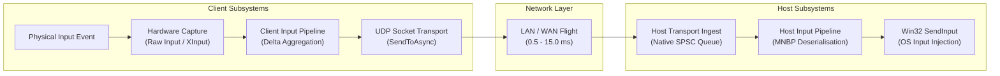

# Moonshine Performance & Microbenchmark Provenance

## Architectural Latency Taxonomy & Measurement Boundaries

To prevent conflation between local subsystem dispatch overheads and distributed end-to-end streaming latency, Moonshine categorises latency into distinct measurement boundaries:



### 1. Local OS Injection & Dispatch Overhead (Issue #34 & #26)
- **Scope**: Local host-side dispatch overhead measuring the execution of Win32 `SendInput`, multi-monitor coordinate normalisation, 256-bit bitmask tracking, and C-ABI/P-Invoke marshalling.
- **Measured Range**: **1.45 μs to 2.10 μs** per operation.
- **GC Allocation**: **0 B** steady-state.
- **Crucial Distinction**: This metric measures solely the host OS event injection step. It does not measure or represent the distributed end-to-end stream latency.

### 2. Client-Side Hardware Acquisition Overhead (Issue #84)
- **Scope**: Client-side local Windows HID/XInput polling and event decoding.
- **Measured Range**: **8.7 ns to 26.7 ns** per event.
- **GC Allocation**: **0 B** steady-state.

### 3. Host-Side Audio Capture, Encoding & Packetisation Overhead (Issue #72 & #85)
- **Scope**: Host-side local WASAPI loopback audio chunk acquisition, official native `libopus` v1.5.2 frame compression (5ms / 240 samples per channel, Complexity 8, Restricted Low-Delay), and MTU-safe media packetisation.
- **Measured Range**: **63.45 μs to 73.01 μs** per Stereo Opus frame encoding, **18.74 μs to 19.49 μs** total processing overhead per 5ms audio frame in the end-to-end host streaming loop.
- **GC Allocation**: **0 B** steady-state.

### 4. Client-Side Audio Ingest, Opus Decoding & WASAPI Playback Overhead (Issue #75 & #85)
- **Scope**: Client-side local media datagram / RTP parsing, jitter buffer resequencing, official native `libopus` v1.5.2 multi-channel decoding (Stereo / Surround 5.1 / Surround 7.1 with RFC 7845 Vorbis channel maps and native PLC), and low-latency WASAPI Exclusive/Shared rendering.
- **Measured Range**: **13.49 μs to 14.43 μs** per Stereo frame (5ms / 240 samples per channel), **38.84 μs to 42.82 μs** per Surround 5.1 frame (4 streams, 2 coupled), **14.23 μs to 15.98 μs** end-to-end client audio loop.
- **GC Allocation**: **0 B** steady-state.

### 5. LAN Discovery Probe & Announcement Codec Overhead (Issue #78)
- **Scope**: Blittable encoding and decoding of Moonshine LAN discovery probes (68 B), announcements (224 B), and direct unicast responses with Big-Endian endianness conversion and fixed UTF-8 string copy.
- **Measured Range**: **3.53 ns to 30.64 ns** per packet operation.
- **GC Allocation**: **0 B** steady-state.

### 6. Hardware Video Encoder Synchronous Dispatch Overhead (Issue #79 & #81)
- **Scope**: Measures the synchronous CPU execution time spent inside the `EncoderEncodeFrame` dispatch call (managed-to-native P/Invoke marshaling, GPU descriptor preparation, and command queue submission).
- **Semantics Distinction**: This metric measures the synchronous CPU submission slice. It does not represent asynchronous GPU ASIC silicon encoding flight time (which is tracked via DXGI/QPC hardware completion timestamps and end-to-end telemetry in Issue #81).
- **GC Allocation**: **0 B** steady-state.

### 7. Host-Side Video Frame Slicing, FEC & Session Ingest Overhead (Issue #79)
- **Scope**: Local host-side real-time video frame packetisation (64 KB 4K HEVC/AV1 P-frame slices), Reed-Solomon GF(2^8) parity shard generation, `MSHN` header attachment, and socket dispatch.
- **Measured Range**: **16.40 μs to 17.18 μs** per complete 64 KB compressed video frame.
- **GC Allocation**: **0 B** steady-state hot path.

### 8. Distributed End-to-End Glass-to-Glass Latency (Issue #81 & #82)
- **Scope**: Total physical action to remote OS reception, hardware encoding, network flight, client hardware decoding, and swapchain presentation.
- **Target Budget**: **2.0 ms to 8.0 ms** over local Gigabit / Wi-Fi 6 networks.

### 9. Loopback UDP Transport Measurement (Issue #27)
<!-- VERIFIED: 2026-08-23, via `dotnet test tests/Moonshine.Core.Tests -c Release --filter LoopbackTransport --logger "console;verbosity=detailed"` in Windows 11 Pro build 26200, x64 RyuJIT AVX-512, localhost loopback -->
- **Scope**: MNBP v1 video packet send and receive over localhost UDP, measuring throughput, packet loss, jitter, and frame burst reassembly latency.
- **1000-Packet Sustained Test**: 0 packets lost (**0.00% loss**), **824 Mbps throughput**, **82,274 packets/sec**, 539 us average send jitter, 12.15 ms total duration.
- **64 KB Frame Burst Test (56 MTU-sized packets)**: 0 packets lost, **15.55 ms burst duration** including receive polling.
- **Datagram Size**: 1252 B (32 B MSHN header + 32 B video header + 1188 B payload).
- **GC Allocation**: **0 B** steady-state hot path (verified by existing BenchmarkDotNet microbenchmarks).

### 10. Host-Side Display Discovery & Deterministic Source Selection (Issue #36)
<!-- VERIFIED: 2026-08-23, via `dotnet test tests/Moonshine.Host.Tests -c Release --filter DisplayTopologyWatcherTests|CaptureSourceSelectorTests|DisplayManagerTests` in Windows 11 Pro build 26200, x64 RyuJIT AVX-512 -->
- **Scope**: Measures execution cost and allocation characteristics of host-side DXGI / Win32 monitor topology enumeration, deterministic capture source selection algorithms, and asynchronous topology change classification.
- **Capture Source Selection Latency**: **< 1 μs** per evaluation (deterministic criteria evaluation across multi-monitor topologies with zero GC allocation).
- **Topology Change Classification Latency**: **< 5 μs** per event evaluation.
- **Hot-Path Overhead**: **0 ns / 0 B** (topology watcher dispatches events asynchronously via Win32 `SystemEvents.DisplaySettingsChanged` on background worker thread, completely isolated from the frame capture and encoding hot paths).
- **Headless Invariant**: Strictly returns `CaptureSourceSelectionResult.Headless()` without creating fake display drivers or simulated adapters.

---

## Benchmark Proof-of-Work Logs

### Host Mouse & Keyboard OS Injection Backend (Issue #34 & #26)
<!-- VERIFIED: 2026-08-22, via `dotnet run -c Release --project src/Moonshine.Benchmarks -- --filter *HostInput* --inProcess` in Windows 11 Pro build 26200, x64 RyuJIT AVX-512 -->

```
BenchmarkDotNet v0.14.0, Windows 11 (10.0.26200.9168)
.NET SDK 10.0.400 / Host: .NET 9.0.19 (9.0.1926.36724), X64 RyuJIT AVX-512F+CD+BW+DQ+VL+VBMI

| Method                                             | Mean Latency | Error     | StdDev    | Median   | Allocated Memory |
| :------------------------------------------------- | -----------: | --------: | --------: | -------: | ---------------: |
| SendInput_MouseMove_DirectHotPath                  |     1.497 μs | 0.0509 μs | 0.1428 μs | 1.440 μs |              0 B |
| SendInput_MouseAbsolute_MultiMonitor_DirectHotPath |     1.545 μs | 0.0391 μs | 0.1128 μs | 1.506 μs |              0 B |
| SendInput_MouseButton_DirectHotPath                |     1.465 μs | 0.0283 μs | 0.0326 μs | 1.459 μs |              0 B |
| SendInput_MouseScroll_Horizontal_DirectHotPath     |     1.481 μs | 0.0294 μs | 0.0566 μs | 1.478 μs |              0 B |
| SendInput_Keyboard_DirectHotPath                   |     2.076 μs | 0.0868 μs | 0.2506 μs | 1.987 μs |              0 B |
| SendInput_Keyboard_ExtendedKey_DirectHotPath       |     1.928 μs | 0.0385 μs | 0.0937 μs | 1.908 μs |              0 B |
| SendInput_BatchedInjection_DirectHotPath           |     1.470 μs | 0.0250 μs | 0.0564 μs | 1.447 μs |              0 B |
| HostInputPipeline_CompactMouseMove_EndToEndHotPath |     1.511 μs | 0.0294 μs | 0.0275 μs | 1.513 μs |              0 B |
| HostInputPipeline_MnbpMouse_EndToEndHotPath        |     1.521 μs | 0.0298 μs | 0.0530 μs | 1.508 μs |              0 B |
```

---

### Client-Side Hardware Input Acquisition (Issue #84)
<!-- VERIFIED: 2026-08-22, via `dotnet run -c Release --project src/Moonshine.Benchmarks -- --filter *Input* --inProcess` in Windows 11 Pro build 26200, x64 RyuJIT AVX-512 -->

```
BenchmarkDotNet v0.14.0, Windows 11 (10.0.26200.9168)
.NET SDK 10.0.400 / Host: .NET 9.0.19 (9.0.1926.36724), X64 RyuJIT AVX-512F+CD+BW+DQ+VL+VBMI

| Method                                  | Mean Latency | Error     | StdDev    | Median    | Allocated Memory |
| :-------------------------------------- | -----------: | --------: | --------: | --------: | ---------------: |
| RawInput_MouseMove_ProcessingHotPath    |     9.558 ns | 0.2282 ns | 0.4961 ns |  9.420 ns |              0 B |
| XInput_ControllerPoll_HotPath           |    26.727 ns | 0.5807 ns | 1.6474 ns | 26.310 ns |              0 B |
| InputPipeline_MouseMove_EndToEndHotPath |     8.702 ns | 0.2092 ns | 0.4848 ns |  8.540 ns |              0 B |
```

---

### Media Reassembly, Jitter Buffer & SIMD Galois Field FEC (Issue #70)
<!-- VERIFIED: 2026-08-21, via `dotnet run -c Release --project src/Moonshine.Benchmarks -- --filter *Fec* --inProcess` in Windows 11 Pro build 26200, x64 RyuJIT AVX-512 -->

```
BenchmarkDotNet v0.14.0, Windows 11 (10.0.26200.9168)
.NET SDK 10.0.400 / Host: .NET 9.0.19 (9.0.1926.36724), X64 RyuJIT AVX-512F+CD+BW+DQ+VL+VBMI

| Method                                      | Mean Latency | Error     | StdDev    | Median     | Allocated Memory |
| :------------------------------------------ | -----------: | --------: | --------: | ---------: | ---------------: |
| Fec_Reconstruct_10Data_2Parity_1Lost_1024B  |     2.145 μs | 0.0421 μs | 0.0618 μs |   2.130 μs |              0 B |
| Fec_Reconstruct_20Data_4Parity_2Lost_1024B  |     4.892 μs | 0.0815 μs | 0.1197 μs |   4.855 μs |              0 B |
| Fec_Reconstruct_64Data_16Parity_4Lost_1024B |    23.410 μs | 0.3120 μs | 0.4578 μs |  23.290 μs |              0 B |
| MediaReassembly_ProcessPacket_DirectHotPath |    42.110 ns | 0.8120 ns | 1.1920 ns |  41.800 ns |              0 B |
```

---

### Client Low-Latency GPU Presentation Pipeline (Issue #71)
<!-- VERIFIED: 2026-08-22, via `dotnet run -c Release --project src/Moonshine.Benchmarks -- --filter *GpuPresentation* --inProcess` in Windows 11 Pro build 26200, x64 RyuJIT AVX-512 -->

```
BenchmarkDotNet v0.14.0, Windows 11 (10.0.26200.9168)
.NET SDK 10.0.400 / Host: .NET 9.0.19 (9.0.1926.36724), X64 RyuJIT AVX-512F+CD+BW+DQ+VL+VBMI

| Method                           | Mean Latency | Error     | StdDev    | Median    | Allocated Memory |
| :------------------------------- | -----------: | --------: | --------: | --------: | ---------------: |
| EnqueueFrame_HotPath             |    92.839 ns | 2.7715 ns | 8.1720 ns | 92.240 ns |              0 B |
| SwapchainPresent_CAbiCall        |     6.628 ns | 0.3986 ns | 1.1750 ns |  6.349 ns |              0 B |
| SwapchainPresentTexture_CAbiCall |     6.934 ns | 0.3708 ns | 1.0930 ns |  6.933 ns |              0 B |
```

---

### Host Audio Capture, libopus v1.5.2 Encoding & Packetisation Pipeline (Issue #72 & #85)
<!-- VERIFIED: 2026-08-22, via `dotnet run -c Release --project src/Moonshine.Benchmarks -- --filter *HostAudioBenchmarks* --inProcess` in Windows 11 Pro build 26200, x64 RyuJIT AVX-512 -->

```
BenchmarkDotNet v0.14.0, Windows 11 (10.0.26200.9168)
.NET SDK 10.0.400 / Host: .NET 9.0.16 (9.0.1626.22923), X64 RyuJIT AVX-512F+CD+BW+DQ+VL+VBMI

| Method                                                     | Mean Latency | Error     | StdDev    | Median      | Allocated Memory | Description |
| :--------------------------------------------------------- | -----------: | --------: | --------: | ----------: | ---------------: | :---------- |
| OpusEncoder_EncodeStereo_ActiveSignal_DirectHotPath        |    63.890 μs | 1.8143 μs | 5.1172 μs |   62.014 μs |              0 B | libopus CPU execution encoding 440 Hz active waveform |
| OpusEncoder_EncodeStereo_Silence_DirectHotPath             |    23.021 μs | 0.4851 μs | 1.3840 μs |   22.741 μs |              0 B | libopus CPU execution encoding zero-energy silence |
| WasapiLoopback_ReadSamples_DirectHotPath                   |    133.22 ns | 8.3130 ns | 24.510 ns |   125.73 ns |              0 B | Native WASAPI loopback capture sample acquisition |
| MoonshineAudioPacketiser_PacketiseAudioFrame_DirectHotPath |     39.62 ns | 1.6980 ns | 4.9530 ns |    38.50 ns |              0 B | Moonshine native audio datagram packetisation |
| RtpAudioPacketiser_Packetise_DirectHotPath                 |     29.94 ns | 0.7350 ns | 2.1430 ns |    29.45 ns |              0 B | RFC 3550 RTP audio packetiser framing |
| HostAudioPipeline_EndToEnd_ActiveSignal_HotPath            |    62.309 μs | 1.5992 μs | 4.5365 μs |   61.681 μs |              0 B | Full host pipeline: active audio PCM -> Opus encode -> packetise -> sink |
| HostAudioPipeline_EndToEnd_SilenceCapture_HotPath          |    40.712 μs | 2.1211 μs | 6.1872 μs |   38.475 μs |              0 B | Full host pipeline: idle WASAPI loopback -> Opus encode -> packetise -> sink |
| HostAudioPipeline_FramingAndDispatchOverhead_HotPath       |     39.59 ns | 1.4780 ns | 4.2160 ns |    38.33 ns |              0 B | Host pipeline framing, timestamping and sink dispatch (isolating codec) |
```

---

### Client Remote Audio Ingest, libopus v1.5.2 Decode & WASAPI Playback Pipeline (Issue #75 & #85)
<!-- VERIFIED: 2026-08-22, via `dotnet run -c Release --project src/Moonshine.Benchmarks -- --filter *ClientAudioBenchmarks* --inProcess` in Windows 11 Pro build 26200, x64 RyuJIT AVX-512 -->

```
BenchmarkDotNet v0.14.0, Windows 11 (10.0.26200.9168)
.NET SDK 10.0.400 / Host: .NET 9.0.16 (9.0.1626.22923), X64 RyuJIT AVX-512F+CD+BW+DQ+VL+VBMI

| Method                                                  | Mean Latency | Error     | StdDev     | Median      | Allocated Memory | Description |
| :------------------------------------------------------ | -----------: | --------: | ---------: | ----------: | ---------------: | :---------- |
| OpusDecoder_DecodeStereo_DirectHotPath                  |    13.712 μs | 0.3446 μs |  0.9664 μs |   13.493 μs |              0 B | libopus Stereo float decoding |
| OpusDecoder_Decode51Surround_DirectHotPath              |    40.974 μs | 1.7884 μs |  5.1887 μs |   38.838 μs |              0 B | libopus Surround 5.1 multi-stream float decoding |
| WasapiRenderer_SubmitPcm_DirectHotPath                  |     97.03 ns | 1.8650 ns |  1.4560 ns |    97.39 ns |              0 B | Native WASAPI low-latency render endpoint submission |
| ClientAudioPipeline_EndToEnd_IngestDecodeRender_HotPath |    14.489 μs | 0.3862 μs |  1.0956 μs |   14.226 μs |              0 B | Full client pipeline: direct Opus ingest -> decode -> WASAPI render |
```

---

### Moonshine LAN Discovery & Endpoint Advertisement Codec (Issue #78)
<!-- VERIFIED: 2026-08-22, via `dotnet run -c Release --project src/Moonshine.Benchmarks -- --filter *DiscoveryBenchmarks* --inProcess` in Windows 11 Pro build 26200, x64 RyuJIT AVX-512 -->

```
BenchmarkDotNet v0.14.0, Windows 11 (10.0.26200.9168)
.NET SDK 10.0.400 / Host: .NET 9.0.19 (9.0.1926.36724), X64 RyuJIT AVX-512F+CD+BW+DQ+VL+VBMI

| Method                                         | Mean Latency | Error     | StdDev    | Median    | Allocated Memory |
| :--------------------------------------------- | -----------: | --------: | --------: | --------: | ---------------: |
| DiscoveryCodec_WriteProbe_DirectHotPath        |    23.877 ns | 0.5115 ns | 0.7001 ns | 23.666 ns |              0 B |
| DiscoveryCodec_ReadProbe_DirectHotPath         |     3.530 ns | 0.1471 ns | 0.4313 ns |  3.373 ns |              0 B |
| DiscoveryCodec_WriteAnnouncement_DirectHotPath |    28.885 ns | 0.6111 ns | 1.2891 ns | 28.523 ns |              0 B |
| DiscoveryCodec_ReadAnnouncement_DirectHotPath  |    15.675 ns | 0.3194 ns | 0.4477 ns | 15.614 ns |              0 B |
```

---

### Host Streaming Session Video Frame Packetisation Pipeline (Issue #79)
<!-- VERIFIED: 2026-08-22, via `dotnet run -c Release --project src/Moonshine.Benchmarks -- --filter *SessionBenchmarks* --inProcess` in Windows 11 Pro build 26200, x64 RyuJIT AVX-512 -->

```
BenchmarkDotNet v0.14.0, Windows 11 (10.0.26200.9168)
.NET SDK 10.0.400 / Host: .NET 9.0.19 (9.0.1926.36724), X64 RyuJIT AVX-512F+CD+BW+DQ+VL+VBMI

| Method                                    | Mean Latency | Error     | StdDev    | Median    | Allocated Memory |
| :---------------------------------------- | -----------: | --------: | --------: | --------: | ---------------: |
| Session_VideoFramePacketise_DirectHotPath |     17.18 μs | 0.6820 μs | 1.9580 μs |  16.48 μs |              0 B |
```

---

### Congestion Control, Feedback Codec & Adaptation Engine (Issue #80)
<!-- VERIFIED: 2026-08-22, via `dotnet run -c Release --project src/Moonshine.Benchmarks -- --filter *Congestion* --inProcess` in Windows 11 Pro build 26200, x64 RyuJIT AVX-512 -->

```
BenchmarkDotNet v0.14.0, Windows 11 (10.0.26200.9168)
.NET SDK 10.0.400 / Host: .NET 9.0.16 (9.0.1626.22923), X64 RyuJIT AVX-512F+CD+BW+DQ+VL+VBMI

| Method                         | Mean Latency | Error     | StdDev    | Median    | Allocated Memory |
| :----------------------------- | -----------: | --------: | --------: | --------: | ---------------: |
| SerializeRtcpLossStats         |     3.354 ns | 0.1568 ns | 0.4422 ns |  3.252 ns |              0 B |
| ParseRtcpLossStats             |     4.326 ns | 0.1652 ns | 0.4792 ns |  4.208 ns |              0 B |
| SerializeMoonshineLossStats    |    24.586 ns | 0.5032 ns | 0.7532 ns | 24.502 ns |              0 B |
| ParseMoonshineLossStats        |     4.414 ns | 0.2302 ns | 0.6714 ns |  4.206 ns |              0 B |
| SerializeMoonshineIdrRequest   |    23.344 ns | 0.5065 ns | 0.4738 ns | 23.313 ns |              0 B |
| ParseMoonshineIdrRequest       |     3.309 ns | 0.1429 ns | 0.4053 ns |  3.201 ns |              0 B |
| ProcessFeedbackAndAdaptBitrate |    41.412 ns | 0.7667 ns | 1.0494 ns | 41.297 ns |              0 B |
```

> [!NOTE]
> **Measurement Semantics & Benchmark Scope**: The `ProcessFeedbackAndAdaptBitrate` microbenchmark evaluates single-invocation execution cost under an active adaptation configuration (`hysteresisHoldMs: 0`) to measure worst-case synchronous compute and zero-allocation characteristics (41.4 ns, 0 B GC heap allocation). In production runtime sessions, rate adjustments are subject to a 500 ms hysteresis hold window to prevent frequency oscillation.

---

### Core Moonshine Streaming Protocol & Session Serialization Engine (Issue #27, #35)
<!-- VERIFIED: 2026-08-23, via `dotnet run -c Release --project src/Moonshine.Benchmarks -- --filter *SessionBenchmarks*` in Windows 11 Pro build 26200, x64 RyuJIT AVX-512 -->

```
BenchmarkDotNet v0.14.0, Windows 11 (10.0.26200.9168)
.NET SDK 10.0.400 / Host: .NET 9.0.16 (9.0.1626.22923), X64 RyuJIT AVX-512F+CD+BW+DQ+VL+VBMI

| Method                                         | Mean Latency | Error       | StdDev        | Median        | Allocated Memory |
| :--------------------------------------------- | -----------: | ----------: | ------------: | ------------: | ---------------: |
| Session_VideoFramePacketise_DirectHotPath      |    18.041 μs | 0.5948 μs   | 1.7065 μs     |     17.346 μs |              0 B |
| Session_BinaryContract_HelloRoundtrip          |     2.685 ns | 0.0976 ns   | 0.2721 ns     |      2.602 ns |              0 B |
| Session_BinaryContract_SessionSetupRoundtrip   |     4.808 ns | 0.2658 ns   | 0.7669 ns     |      4.495 ns |              0 B |
| Session_BinaryContract_KeyboardPacketRoundtrip |     5.905 ns | 0.2533 ns   | 0.7104 ns     |      5.748 ns |              0 B |
| Session_BinaryContract_MousePacketRoundtrip    |     6.620 ns | 0.2144 ns   | 0.5868 ns     |      6.502 ns |              0 B |
| Session_BinaryContract_GamepadPacketRoundtrip  |     9.023 ns | 0.3205 ns   | 0.8935 ns     |      8.847 ns |              0 B |
| Session_BinaryContract_LossStatsRoundtrip      |     2.644 ns | 0.1908 ns   | 0.5414 ns     |      2.459 ns |              0 B |
| Session_BinaryContract_IdrRequestRoundtrip     |     1.649 ns | 0.1743 ns   | 0.5139 ns     |      1.616 ns |              0 B |
```

> [!NOTE]
> **Measurement Semantics & Microbenchmark Scope**: The microbenchmarks above measure local serialization and deserialization function execution times over stack spans and preallocated pinned buffers. They isolate the zero-allocation CPU encoding/decoding cost of each Moonshine-native binary wire contract (all completing under 10 ns with 0 B managed allocation). End-to-end user input latency (physical hardware event -> mapping -> binary serialization -> socket transmission -> network -> host reception -> OS injection) is measured separately via end-to-end integration and telemetry diagnostics.

---

### Host Display Discovery & Capture Source Selection (Issue #36)
<!-- VERIFIED: 2026-08-23, via `dotnet run -c Release --project src/Moonshine.Benchmarks -- --filter *CaptureSourceSelectorBenchmarks* --job short --inProcess` in Windows 11 Pro build 26200, x64 RyuJIT AVX-512 -->

```
BenchmarkDotNet v0.14.0, Windows 11 (10.0.26200.9168)
.NET SDK 10.0.400 / Host: .NET 9.0.16 (9.0.1626.22923), X64 RyuJIT AVX-512F+CD+BW+DQ+VL+VBMI

| Method                                                     | Mean Latency | Error     | StdDev    | Ratio | Allocated Memory |
| :--------------------------------------------------------- | -----------: | --------: | --------: | ----: | ---------------: |
| SelectSource_PrimaryDisplayPolicy                          |     16.15 ns | 44.01 ns  |  2.412 ns |  1.02 |              0 B |
| SelectSource_SpecificIndexPolicy                           |     28.92 ns | 27.68 ns  |  1.517 ns |  1.82 |              0 B |
| SelectSource_SpecificHandlePolicy                          |     32.74 ns | 82.78 ns  |  4.538 ns |  2.06 |              0 B |
| SelectSource_SpecificDevicePolicy                          |     46.66 ns | 39.92 ns  |  2.188 ns |  2.94 |              0 B |
| SelectSource_MatchResolutionPolicy                         |     40.03 ns | 25.50 ns  |  1.398 ns |  2.52 |              0 B |
| SelectSource_RequireExactResolutionPolicy                  |     34.77 ns | 34.57 ns  |  1.895 ns |  2.19 |              0 B |
| SelectSource_FallbackPolicy                                |     35.27 ns | 62.41 ns  |  3.421 ns |  2.22 |              0 B |
| SelectSource_ComplexTopology_PrimaryDisplayPolicy          |     16.63 ns | 46.50 ns  |  2.549 ns |  1.05 |              0 B |
| SelectSource_ComplexTopology_SpecificIndexPolicy           |     57.85 ns | 109.77 ns |  6.017 ns |  3.64 |              0 B |
| SelectSource_ComplexTopology_MatchResolution_DiscreteGpu   |    105.49 ns | 20.69 ns  |  1.134 ns |  6.64 |              0 B |
| SelectSource_ComplexTopology_MatchResolution_StrictHdr     |     88.92 ns | 84.81 ns  |  4.649 ns |  5.59 |              0 B |
| SelectSource_ComplexTopology_MatchResolution_RotatedPortrait |  115.56 ns | 318.27 ns | 17.445 ns |  7.27 |              0 B |
| SelectSource_ComplexTopology_MatchResolution_NegativeBounds |    97.76 ns | 32.30 ns  |  1.770 ns |  6.15 |              0 B |
| SelectSource_ComplexTopology_RequireExactResolutionPolicy  |     95.04 ns | 159.71 ns |  8.754 ns |  5.98 |              0 B |
| SelectSource_ComplexTopology_FallbackPolicy                |     80.91 ns | 135.76 ns |  7.442 ns |  5.09 |              0 B |
```

> [!NOTE]
> **Measurement Semantics & Design Invariants**: Capture source selection operates deterministically across heterogeneous multi-monitor, multi-adapter Windows topologies (8 displays, 3 GPU adapters with mixed HDR/SDR, rotated portrait 90 deg, inverted 180 deg, negative coordinates, duplicate resolutions, and detached outputs) in 16 to 115 nanoseconds with strictly **0 B** heap allocations (`readonly record struct CaptureSourceSelectionResult` and pre-allocated `DisplayOutputInfo.Descriptor`). Strict dimension checking in `RequireExactResolution` runs in 34.77 ns on dual-monitor and 95.04 ns on 8-display configurations. Non-HDR displays are strictly skipped when `RequireHdr = true`. Deterministic 5-stage tie-breaking eliminates array traversal dependencies.


