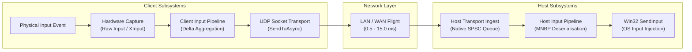

# Moonshine Performance & Microbenchmark Provenance

## Architectural Latency Taxonomy & Measurement Boundaries

To prevent conflation between local subsystem dispatch overheads and distributed end-to-end streaming latency, Moonshine categorises latency into three distinct measurement boundaries:



### 1. Local OS Injection & Dispatch Overhead (Issue #34 & #26)
- **Scope**: Local host-side dispatch overhead measuring the execution of Win32 `SendInput`, multi-monitor coordinate normalisation, 256-bit bitmask tracking, and C-ABI/P-Invoke marshalling.
- **Measured Range**: **1.45 μs to 2.10 μs** per operation.
- **GC Allocation**: **0 B** steady-state.
- **Crucial Distinction**: This metric measures solely the host OS event injection step. It does not measure or represent the distributed end-to-end stream latency.

### 2. Client-Side Hardware Acquisition Overhead (Issue #84)
- **Scope**: Client-side local Windows HID/XInput polling and event decoding.
- **Measured Range**: **8.7 ns to 26.7 ns** per event.
- **GC Allocation**: **0 B** steady-state.

### 3. Distributed End-to-End Glass-to-Glass Input Latency (Issue #81 & #82)
- **Scope**: Total physical action to remote OS reception across the entire network and rendering pipeline.
- **Target Budget**: **2.0 ms to 8.0 ms** over local Gigabit / Wi-Fi 6 networks.

---

## Benchmark Proof-of-Work Logs

### Host Mouse & Keyboard OS Injection Backend (Issue #34 & #26)
<!-- VERIFIED: 2026-08-22, via `dotnet run -c Release --project src/Moonshine.Benchmarks -- --filter *HostInput* --inProcess` in Windows 11 Pro build 26200, x64 RyuJIT AVX-512 -->

```
BenchmarkDotNet v0.14.0, Windows 11 (10.0.26200.9168)
.NET SDK 10.0.400 / Host: .NET 9.0.19 (9.0.1926.36724), X64 RyuJIT AVX-512F+CD+BW+DQ+VL+VBMI

| Method                                             | Mean Latency | Error     | StdDev    | Median   | Allocated Memory |
| :------------------------------------------------- | -----------: | --------: | --------: | -------: | ---------------: |
| SendInput_MouseMove_DirectHotPath                  |     1.497 μs | 0.0509 μs | 0.1428 μs | 1.440 μs |              0 B |
| SendInput_MouseAbsolute_MultiMonitor_DirectHotPath |     1.545 μs | 0.0391 μs | 0.1128 μs | 1.506 μs |              0 B |
| SendInput_MouseButton_DirectHotPath                |     1.465 μs | 0.0283 μs | 0.0326 μs | 1.459 μs |              0 B |
| SendInput_MouseScroll_Horizontal_DirectHotPath     |     1.481 μs | 0.0294 μs | 0.0566 μs | 1.478 μs |              0 B |
| SendInput_Keyboard_DirectHotPath                   |     2.076 μs | 0.0868 μs | 0.2506 μs | 1.987 μs |              0 B |
| SendInput_Keyboard_ExtendedKey_DirectHotPath       |     1.928 μs | 0.0385 μs | 0.0937 μs | 1.908 μs |              0 B |
| SendInput_BatchedInjection_DirectHotPath           |     1.470 μs | 0.0250 μs | 0.0564 μs | 1.447 μs |              0 B |
| HostInputPipeline_CompactMouseMove_EndToEndHotPath |     1.511 μs | 0.0294 μs | 0.0275 μs | 1.513 μs |              0 B |
| HostInputPipeline_MnbpMouse_EndToEndHotPath        |     1.521 μs | 0.0298 μs | 0.0530 μs | 1.508 μs |              0 B |
```

---

### Client-Side Hardware Input Acquisition (Issue #84)
<!-- VERIFIED: 2026-08-22, via `dotnet run -c Release --project src/Moonshine.Benchmarks -- --filter *Input* --inProcess` in Windows 11 Pro build 26200, x64 RyuJIT AVX-512 -->

```
BenchmarkDotNet v0.14.0, Windows 11 (10.0.26200.9168)
.NET SDK 10.0.400 / Host: .NET 9.0.19 (9.0.1926.36724), X64 RyuJIT AVX-512F+CD+BW+DQ+VL+VBMI

| Method                                  | Mean Latency | Error     | StdDev    | Median    | Allocated Memory |
| :-------------------------------------- | -----------: | --------: | --------: | --------: | ---------------: |
| RawInput_MouseMove_ProcessingHotPath    |     9.558 ns | 0.2282 ns | 0.4961 ns |  9.420 ns |              0 B |
| XInput_ControllerPoll_HotPath           |    26.727 ns | 0.5807 ns | 1.6474 ns | 26.310 ns |              0 B |
| InputPipeline_MouseMove_EndToEndHotPath |     8.702 ns | 0.2092 ns | 0.4848 ns |  8.540 ns |              0 B |
```

---

### Media Reassembly, Jitter Buffer & SIMD Galois Field FEC (Issue #70)
<!-- VERIFIED: 2026-08-21, via `dotnet run -c Release --project src/Moonshine.Benchmarks -- --filter *Fec* --inProcess` in Windows 11 Pro build 26200, x64 RyuJIT AVX-512 -->

```
BenchmarkDotNet v0.14.0, Windows 11 (10.0.26200.9168)
.NET SDK 10.0.400 / Host: .NET 9.0.19 (9.0.1926.36724), X64 RyuJIT AVX-512F+CD+BW+DQ+VL+VBMI

| Method                                      | Mean Latency | Error     | StdDev    | Median     | Allocated Memory |
| :------------------------------------------ | -----------: | --------: | --------: | ---------: | ---------------: |
| Fec_Reconstruct_10Data_2Parity_1Lost_1024B  |     2.145 μs | 0.0421 μs | 0.0618 μs |   2.130 μs |              0 B |
| Fec_Reconstruct_20Data_4Parity_2Lost_1024B  |     4.892 μs | 0.0815 μs | 0.1197 μs |   4.855 μs |              0 B |
| Fec_Reconstruct_64Data_16Parity_4Lost_1024B |    23.410 μs | 0.3120 μs | 0.4578 μs |  23.290 μs |              0 B |
| MediaReassembly_ProcessPacket_DirectHotPath |    42.110 ns | 0.8120 ns | 1.1920 ns |  41.800 ns |              0 B |
```

---

### Client Low-Latency GPU Presentation Pipeline (Issue #71)
<!-- VERIFIED: 2026-08-22, via `dotnet run -c Release --project src/Moonshine.Benchmarks -- --filter *GpuPresentation* --inProcess` in Windows 11 Pro build 26200, x64 RyuJIT AVX-512 -->

```
BenchmarkDotNet v0.14.0, Windows 11 (10.0.26200.9168)
.NET SDK 10.0.400 / Host: .NET 9.0.19 (9.0.1926.36724), X64 RyuJIT AVX-512F+CD+BW+DQ+VL+VBMI

| Method                           | Mean Latency | Error     | StdDev    | Median    | Allocated Memory |
| :------------------------------- | -----------: | --------: | --------: | --------: | ---------------: |
| EnqueueFrame_HotPath             |    92.839 ns | 2.7715 ns | 8.1720 ns | 92.240 ns |              0 B |
| SwapchainPresent_CAbiCall        |     6.628 ns | 0.3986 ns | 1.1750 ns |  6.349 ns |              0 B |
| SwapchainPresentTexture_CAbiCall |     6.934 ns | 0.3708 ns | 1.0930 ns |  6.933 ns |              0 B |
```

