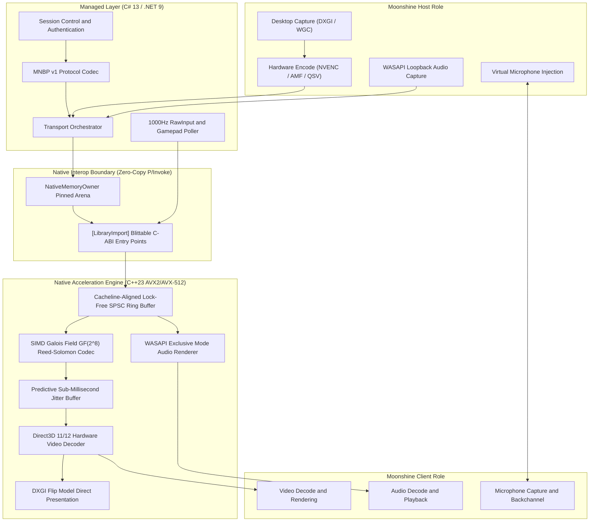

# Architecture Overview

> **Status**: This page describes the target architecture of Moonshine. Component maturity varies. See the [Project Status](https://github.com/CodeGrogu/Moonshine#project-status) for current implementation state. The application composition root is **fail-closed** until Moonshine-native session control and media transport are complete.

Moonshine is architected as a two-tier hybrid engine engineered to decouple control-plane flexibility from data-plane throughput. The application provides selectable Host, Client, and Host + Client runtime roles within a single executable.

---

## 1. Managed Layer: Protocol and Control Plane (C# 13)

The managed layer handles all high-level asynchronous workflows, state machines, cryptographic handshakes, and input polling:

- `Moonshine.Protocol`: Zero-allocation binary codecs for the Moonshine Native Binary Protocol (MNBP v1), including packet envelope serialisation, session control messages, media framing headers, feedback payloads, input injection packets, and host management commands. Legacy RTP/RTSP/SDP parsers exist for compatibility reference but are not used by production roles.
- `Moonshine.Core`:
  - Session lifecycle and authentication management.
  - Hardware capability discovery and GPU adapter enumeration.
  - Socket ingestion pipelines with `System.IO.Pipelines`.
  - Legacy modules (`MoonshineDiscoveryService`, `MoonshinePairingManager`, `MoonshineStreamSession`, `UdpSocketPipeline`) exist for audit reference but are classified as Incompatible and unreachable from the production composition root.
- `Moonshine.Host`: Host-role capture, encoding, audio, microphone, and device components.
- `Moonshine.Client`: Client-role receiving, decoding, rendering, and input components.

---

## 2. Native Layer: Acceleration and Data Plane (C++23)

The native engine is compiled as the Windows dynamic library `Moonshine.Native.dll` with strict cache alignment and SIMD acceleration:

- `reed_solomon_simd`: Implements vectorised Galois Field GF(2^8) multiplication and XOR matrix transformations via AVX2 and AVX-512 GFNI. **Status**: Verified (CTest).
- `spsc_ring_buffer`: Lock-free single-producer single-consumer circular queue padded to 64 bytes (`alignas(64)`) to eliminate multi-core cacheline contention. **Status**: Verified (CTest).
- `jitter_buffer`: Predictive frame reassembly buffer tracking frame indices and sequence numbers without dynamic memory allocations. **Status**: Verified (CTest).
- `d3d11_video_decoder`: Direct3D 11/12 hardware decode pipeline with zero-copy texture sharing and DXGI Flip Model presentation. **Status**: Incomplete (capability discovery implemented, physical bitstream decoding in progress).
- `wasapi_renderer`: Low-latency WASAPI Exclusive mode audio output directly driving audio hardware buffers. **Status**: Prototype.

---

## 3. Strict Blittable Interop Boundary

All structures passed between C# and C++ are 1:1 blittable with exact byte alignments:

- `MoonshinePacketDesc`: 48 bytes (frame index, packet sequence, payload pointer, payload length, flags, timestamp).
- `MoonshineFrameDesc`: 56 bytes (frame index, slice count, total payload bytes, presentation time).
- `MoonshineDecoderCaps`: 44 bytes (resolution, FPS, codec flags for AV1, HEVC, H.264, HDR10, D3D12, Vulkan).

P/Invoke calls use `[LibraryImport]` source generators to produce direct assembly call instructions without runtime marshalling.

---

## 4. Legacy Compatibility Architecture (Reference Only)

> **Note**: The following describes the historical GameStream/Sunshine compatibility prototype. These modules are classified as **Incompatible** in the `BASELINE_AUDIT.md` and are unreachable from the `MoonshineApplication` composition root. They are retained for audit and migration reference only.

The legacy compatibility path communicated with Sunshine/GameStream hosts over HTTPS (Port 47989/47984) for discovery and pairing, RTSP/TCP (Port 48010) for stream negotiation, and RTP/UDP for media transport. This architecture is being replaced by the Moonshine Native Binary Protocol (MNBP v1).
