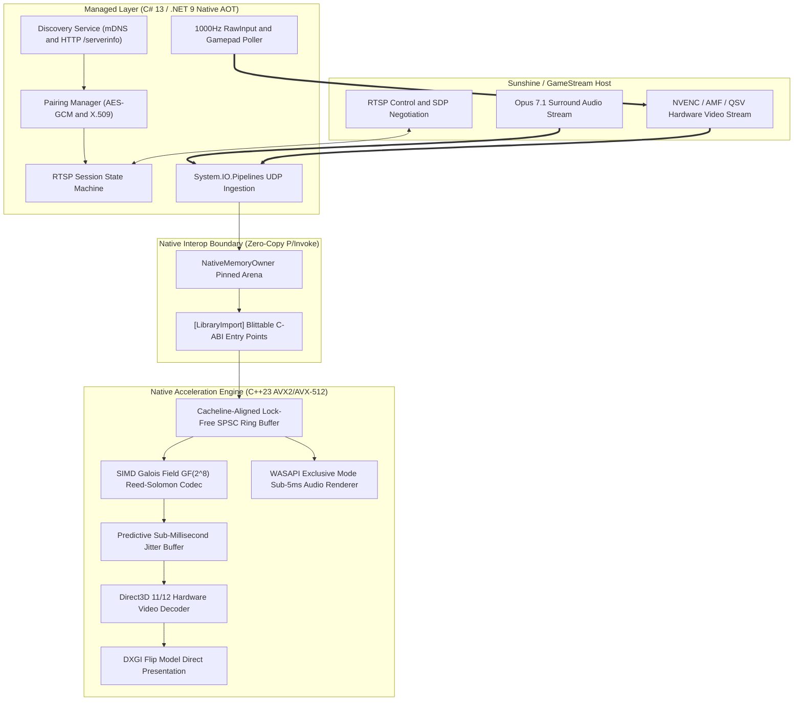

# Architecture Overview

Moonshine is architected as a two-tier hybrid engine engineered to decouple control-plane flexibility from data-plane throughput.

---

## 1. Managed Layer: Protocol and Control Plane (C# 13)

The managed layer handles all high-level asynchronous workflows, state machines, cryptographic handshakes, and input polling:
- `Moonshine.Protocol`: Zero-allocation binary parsers for RTP (RFC 3550), FEC, RTSP/SDP, encrypted control frames, and input events.
- `Moonshine.Core`:
  - `MoonshineDiscoveryService`: Discovers Sunshine and GameStream hosts over IPv4/IPv6 broadcast and mDNS (`_nvstream._tcp.local`).
  - `MoonshinePairingManager`: Implements the two-step AES-128-GCM challenge-response authentication protocol with self-signed X.509 client certificates.
  - `MoonshineStreamSession`: Manages the RTSP lifecycle (`OPTIONS`, `DESCRIBE`, `SETUP`, `PLAY`, `TEARDOWN`).
  - `UdpSocketPipeline`: High-throughput asynchronous socket receiver backed by unmanaged native memory blocks.
- `Moonshine.Client`: Orchestration engine providing Native AOT console and GUI entry points.

---

## 2. Native Layer: Acceleration and Data Plane (C++23)

The native engine is compiled as a shared library (`Moonshine.Native.dll` on Windows, `.so` on Linux) with strict cache alignment and SIMD acceleration:
- `reed_solomon_simd`: Implements vectorised Galois Field GF(2^8) multiplication and XOR matrix transformations via AVX2 and AVX-512.
- `spsc_ring_buffer`: Lock-free single-producer single-consumer circular queue padded to 64 bytes (`alignas(64)`) to eliminate multi-core cacheline contention.
- `jitter_buffer`: Predictive frame reassembly buffer tracking frame indices and sequence numbers without dynamic memory allocations.
- `d3d11_video_decoder`: Direct3D 11/12 hardware decode pipeline with zero-copy texture sharing and DXGI Flip Model presentation.
- `wasapi_renderer`: Low-latency WASAPI Exclusive mode audio output directly driving audio hardware buffers.

---

## 3. Strict Blittable Interop Boundary

All structures passed between C# and C++ are 1:1 blittable with exact byte alignments:
- `MoonshinePacketDesc`: 48 bytes (frame index, packet sequence, payload pointer, payload length, flags, timestamp).
- `MoonshineFrameDesc`: 56 bytes (frame index, slice count, total payload bytes, presentation time).
- `MoonshineDecoderCaps`: 44 bytes (resolution, FPS, codec flags for AV1, HEVC, H.264, HDR10, D3D12, Vulkan).

P/Invoke calls use `[LibraryImport]` source generators to produce direct assembly call instructions without runtime marshaling.
