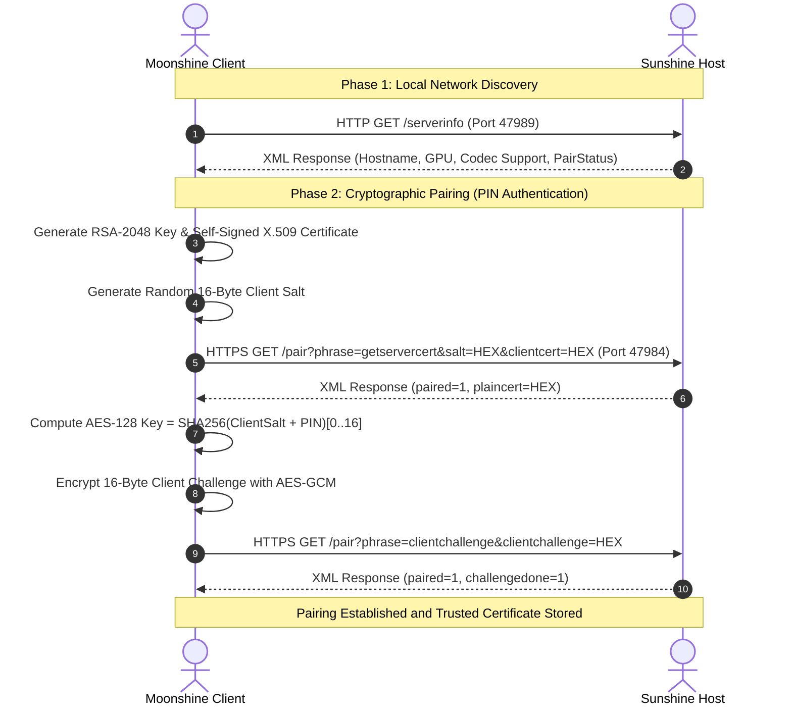

# GameStream and Sunshine Protocol Specification (Legacy Compatibility Reference)

> [!WARNING]
> **LEGACY COMPATIBILITY REFERENCE**
> This document describes legacy compatibility code that is classified as **Incompatible** and unreachable from the production composition root. Moonshine is its own platform with its own protocol (MNBP v1), defined in `docs/PROTOCOL_SPEC_V1.md`. This is NOT a GameStream client or Moonlight replacement.

## 1. Network Topology and Port Matrix

Moonshine communicates with Sunshine / GameStream hosts over a combination of TCP and UDP ports:

| Port | Protocol | Purpose | Direction |
| :--- | :--- | :--- | :--- |
| **47989** | HTTP (TCP) | Host Discovery & Capabilities (`/serverinfo`) | Inbound / Outbound |
| **47984** | HTTPS (TCP) | Secure Discovery & Pairing Handshake (`/pair`) | Inbound / Outbound |
| **47990** | HTTP (TCP) | App list and stream launch requests (`/launch`) | Outbound |
| **48010** | RTSP (TCP) | Stream session negotiation & SDP exchange | Outbound |
| **47998** | Video RTP (UDP) | Primary video stream data and FEC parity shards | Inbound |
| **48000** | Audio RTP (UDP) | Low-latency multi-channel Opus audio stream | Inbound |
| **47999** | Control (UDP) | Stream loss reports, IDR request, ping/pong | Bidirectional |
| **48010** | Input (UDP) | 1000Hz Gamepad, Keyboard, Mouse, and Touch events | Outbound |

## 2. Discovery and Cryptographic Pairing Handshake

## 3. RTSP Stream Negotiation State Machine

Once paired, Moonshine negotiates video resolution, frame rate, bitrate, and codec parameters over RTSP (Port 48010):

1. `OPTIONS`: Queries host capabilities.
2. `DESCRIBE`: Requests SDP session description specifying video resolution (for example: `1920x1080`), FPS (`120`), and audio format (`48kHz stereo`).
3. `SETUP`: Configures UDP transport channels for video (port 47998), audio (port 48000), and control (port 47999).
4. `PLAY`: Initiates real-time UDP stream transmission.
5. `TEARDOWN`: Gracefully terminates the session and resets the host capture pipeline.

## 4. Binary Packet Layouts

### RTP Video Header (RFC 3550)
- 12 Bytes fixed header:
  - Byte 0: `Version` (2 bits), `Padding` (1 bit), `Extension` (1 bit), `CSRC Count` (4 bits).
  - Byte 1: `Marker` (1 bit: last packet of video frame), `Payload Type` (7 bits: 96 for H.264/HEVC/AV1).
  - Bytes 2-3: `Sequence Number` (16-bit big-endian).
  - Bytes 4-7: `Timestamp` (32-bit big-endian, 90kHz clock).
  - Bytes 8-11: `SSRC Identifier` (32-bit big-endian).

### Forward Error Correction (FEC) Shard Header
- Attached before RTP video payload:
  - `Shard Index` (8 bits): Position of shard in current FEC block ($0 \le \text{idx} < N$).
  - `Data Shard Count` (8 bits): Total data packets in block ($K$).
  - `Total Shard Count` (8 bits): Data plus parity packets ($N$).
  - `Block Sequence` (16 bits): Monotonic FEC block identifier.
